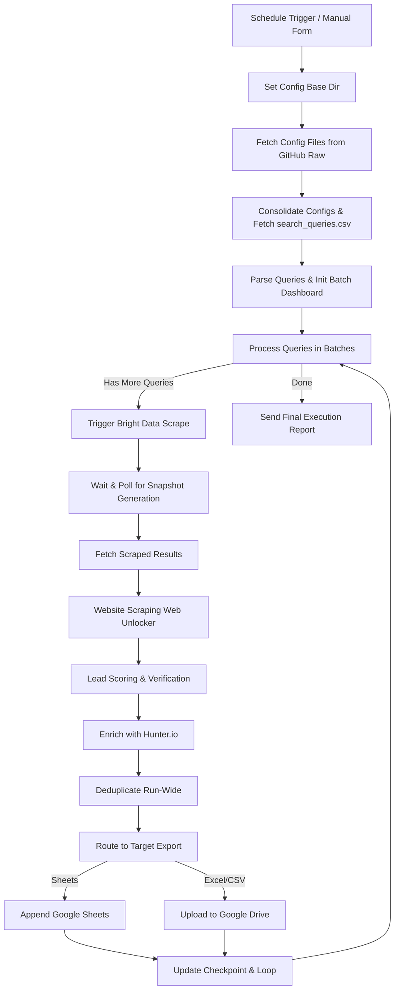

# Maharashtra Agricultural Lead Generation Platform — n8n Cloud Configs

This repository contains the production-ready, configuration-driven lead generation platform optimized specifically for **n8n Cloud**. The pipeline fetches B2B listings from Bright Data's Google Maps dataset, enriches them using Hunter.io, performs deduplication and lead scoring, and exports the structured data to Google Sheets or Google Drive folders.

---

## 📂 Repository Structure

```
.
├── .env.example                  # Template for required environment variables
├── README.md                     # Platforms setup, operations, and reference manual
├── workflow.json                 # Production-ready n8n workflow definition
├── workflow_constants.json       # Reusable constants (state, country, target queries)
├── workflow_settings.json        # Execution schedule, retry limits, and error configurations
├── environment.json              # Technical reference for deployment environments
├── search_parameters.json        # Throttling, budgets, cost limits, and verification toggles
├── brightdata_dataset_mapping.json # API endpoints and expected fields for Bright Data datasets
├── hunter_mapping.json           # API specs, confidence thresholds, and mappings for Hunter.io
├── validation_rules.json         # Pincode regex, lead scoring weights, and phone normalization
├── output_mapping.json           # Ordering and formatting rules for final spreadsheet columns
├── output_schema.json            # Complete 32-field schema for developers
├── cities.json                   # Master list of 149 Maharashtra cities (canonical reference)
├── categories.json               # Master list of 26 Agricultural Machinery intent labels (canonical)
├── city_lookup.json              # City ID lookup table (generated from cities.json)
├── category_lookup.json          # Category ID lookup table (generated from categories.json)
├── search_queries.json           # Full generated list of 3,874 search queries (JSON format)
└── search_queries.csv            # Full generated list of 3,874 search queries (CSV format)
```

---

## 📄 Configuration Files & Schema References

Each file in this repository governs a specific part of the pipeline's logic:

### 1. Lookup and Geographic References
- **`cities.json` & `categories.json`:** The master datasets listing all 149 Maharashtra cities and 26 agricultural business categories. Used as the single source of truth for query combinations.
- **`city_lookup.json` & `category_lookup.json`:** Structured lookup tables map City/Category IDs to their respective details, enabling O(1) matching in n8n Code nodes.
- **`search_queries.json` & `search_queries.csv`:** Pre-generated combinations of all 3,874 query targets. Each query follows the canonical format `<Category> in <City> Maharashtra India`.

### 2. API Integration Mappings
- **`brightdata_dataset_mapping.json`:** Defines dataset IDs, polling/trigger endpoints, and schema attributes for Bright Data Google Maps and Search API scraping.
- **`hunter_mapping.json`:** Maps Hunter.io response attributes to the internal schema, enforcing confidence thresholds (minimum score of 70) and position classifications.

### 3. Business Logic and Formatting Rules
- **`search_parameters.json`:** Regulates loop performance, request concurrency limits, batch delays, and budget controls.
- **`search_rules.json`:** Governs blacklist domains (social media, listing aggregates) and retry mechanisms.
- **`validation_rules.json`:** Implements Indian mobile validation, Maharashtra pincode regex validation, and the lead scoring rubric.
- **`output_mapping.json` & `output_schema.json`:** Defines the 8-column simplified output schema for final spreadsheet export, as well as the full 32-field database schema for integrations.

---

## ⚙️ Required Environment Variables

All parameters governing access and execution limits must be configured inside your n8n Cloud instance's Environment Variables (under **Settings → Environment Variables**). Do **NOT** hardcode credentials or secrets inside the workflow.

| Variable | Description | Example Value |
|---|---|---|
| `GITHUB_RAW_BASE_URL` | Base URL of your repository's raw branch to load configs. | `https://raw.githubusercontent.com/your-org/repo/main/` |
| `CONFIG_BASE_DIR` | Local directory prefix fallback for configuration. | `./` |
| `BRIGHTDATA_API_KEY` | Your Bright Data API account token. | `brd_api_key_xxxxxx` |
| `BRIGHTDATA_USERNAME` | Username for Bright Data's Web Unlocker proxy zone. | `brd-customer-xxxx-zone-unlocker` |
| `BRIGHTDATA_PASSWORD` | Password for Bright Data's Web Unlocker proxy zone. | `xxxxxxxxx` |
| `HUNTER_API_KEY` | Your Hunter.io developer API key. | `hunter_api_key_xxxxxx` |
| `GOOGLE_SHEET_ID` | Spreadsheet ID used for the Google Sheets export and checkpointing. | `1A2B3C4D5E6F7G8H9I0J` |
| `GOOGLE_SHEET_TAB_NAME`| Target tab name in the spreadsheet. | `MH Agri Leads` |
| `GOOGLE_DRIVE_FOLDER_ID` | Folder ID in Google Drive where Excel/CSV outputs are stored. | `0B1C2D3E4F5G6H7I8J9` |
| `DATASTORE_NAME` | Identifier for the state database. | `mh_agri_leads_state` |
| `BATCH_SIZE` | Quantity of search queries to run in a single batch iteration. | `50` |
| `CONCURRENCY` | Parallel requests to execute simultaneously. | `2` |
| `MAX_RETRIES` | Number of times to retry failed API calls. | `5` |
| `POLL_INTERVAL` | Polling wait time in milliseconds for dataset snapshot generation. | `10000` |
| `OUTPUT_FORMAT` | Final export target. Options: `google_sheets`, `excel`, `csv`. | `google_sheets` |
| `LOG_LEVEL` | Logging verbosity. Options: `debug`, `info`, `warn`, `error`. | `info` |

---

## 🚀 Services Integration & Setup

### 1. GitHub Raw Config Hosting
Because n8n Cloud does not support local file read operations (e.g. `Read File` or `Read Binary File`), all reference files must be loaded over HTTP.
1. Commit the canonical reference and JSON mapping files to your GitHub repository.
2. Configure `GITHUB_RAW_BASE_URL` in n8n Cloud pointing to the raw base directory of your repository, e.g. `https://raw.githubusercontent.com/<username>/<repo-name>/main/`.

### 2. Bright Data Google Maps Dataset
The pipeline triggers a Google Maps scrape via Bright Data.
- **Dataset ID:** `gd_l7q7dkf244hwjntr0`
- **Zone Setup:** Verify that you have an active **SERP API** zone and a **Web Unlocker** proxy zone enabled in your Bright Data control panel.
- Ensure your Bright Data API credentials are set in n8n Cloud as an **HTTP Header Auth** credential named `Bright Data API` using the header name `Authorization` and value `Bearer {{ $env.BRIGHTDATA_API_KEY }}`.

### 3. Hunter.io Verification
For leads with a business website but no email found via Maps scraping:
- The workflow queries Hunter's Domain Search API (`https://api.hunter.io/v2/domain-search`) to fetch verified professional emails.
- It applies the score threshold in `hunter_mapping.json` (confidences below 70 are filtered out).

### 4. Google Sheets (Checkpoints)
- Create a Google Sheet. By default, the tab name is `MH Agri Leads`.
- The first row must contain columns matching the simplified schema headers defined in `output_mapping.json`:
  `Company Name`, `Pincode`, `Category`, `Location`, `Mobile NO`, `Email`, `Website`, `Address`
- Configure Google Sheets credentials in n8n Cloud under **Credentials → Add Credential → Google Sheets OAuth2 API** named `Google Sheets OAuth2`.

### 5. Google Drive (Output Storage)
- If `OUTPUT_FORMAT` is set to `excel` or `csv`, the workflow converts the batch outputs in memory and uploads them directly to the target folder `GOOGLE_DRIVE_FOLDER_ID`.
- Configure Google Drive credentials in n8n Cloud under **Credentials → Add Credential → Google Drive OAuth2 API** named `Google Drive OAuth2`.

---

## ⚙️ Execution Flow

The workflow operates as an automated state-machine loop:



---

## 🛠️ Deployment & Testing Guide

### Deployment
1. Log in to your **n8n Cloud** dashboard.
2. Select **Workflows → Import from File** and upload the `workflow.json` from this repository.
3. Configure all variables in the **Settings → Environment Variables** panel.
4. Set up your Google Sheets, Google Drive, and Bright Data Credentials.

### Testing
- **Single Batch Test:** Set the loop batch size to `1` or `2` in `search_parameters.json` or through the environment variable `BATCH_SIZE` to test the pipeline end-to-end.
- **Dry Run validation:** Use the **Form Submission Trigger** to run a test execute, selecting `google_sheets` to inspect the generated rows.

---

## 🔄 Recovery & Troubleshooting

### Checkpoint & Resuming
- The workflow persists state using n8n's **Workflow Static Data** under the global context.
- If execution fails due to API timeouts, n8n Cloud's auto-retry logic triggers. If the entire workflow crashes, the next scheduled invocation reads the static data and skips already processed `SearchID`s (resuming exactly where it failed).
- To clear the checkpoint and force a clean, complete rebuild of all 3,874 queries, execute a manual start with a clearing flag or clear the static data inside the n8n Cloud execution options.

### Common Errors
- **Error loading configurations:** Verify `GITHUB_RAW_BASE_URL` is correct and publicly accessible without authentication.
- **Bright Data Timeout:** Bright Data's snapshot API can take up to 5 minutes to generate results under heavy load. Ensure the `Wait For Data` delay node is set to at least 10000ms.
- **Hunter Quota Limits:** If Hunter.io returns `429` (Too Many Requests), the API rate-limiter in the httpRequest node will automatically back off and retry.

---

## 📜 Version History

- **v1.1.0 (Current):** Cloud-native HTTP Request loading enabled, direct Google Drive export for Excel/CSV implemented, placeholder credential IDs replaced with production-ready types, and environment variables synchronized with `.env.example`.
- **v1.0.0:** Initial configuration, reference tables, and baseline workflow template.
